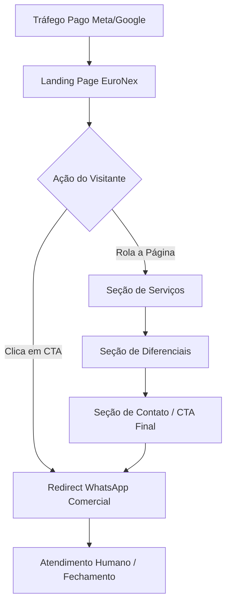

# Diagramas e Estrutura do Projeto: Euronex Turismo Web

Este documento contém a visão técnica, arquitetural e o cronograma de desenvolvimento (Sprints) para o front-end da Euronex Turismo — uma Landing Page de alta conversão voltada para campanhas de tráfego pago, com futura integração ao backend `euronex-gateway`.

## 🏗️ Estrutura Técnica (Arquitetura)

### Visão Geral

Landing Page estática e de alta performance desenvolvida em **Next.js 16 (App Router) + Vanilla CSS**. O objetivo imediato é converter visitantes de tráfego pago em leads via WhatsApp. A arquitetura já prevê a conexão futura com o `euronex-gateway` (Java/Spring Boot) para exibição de catálogo de transfers e sistema de reserva.

### Identidade Visual

| Token | Valor | Uso |
| --- | --- | --- |
| `--color-dark` | `#0a1b26` | Fundo principal, textos escuros |
| `--color-gold` | `#ce943e` | Destaque, botões, CTA |
| `--color-light` | `#dfe6f0` | Fundos secundários, cards |
| `--font-heading` | `Lora` (Serif) | Títulos e headline |
| `--font-body` | `Inter` (Sans-serif) | Textos e botões |

### Diagrama de Fluxo



### Estrutura de Pastas

```text
euronex-turismo-web/
├── src/
│   └── app/
│       ├── layout.tsx       # Layout raiz, importa fontes e globals.css
│       ├── page.tsx         # Página principal (Landing Page)
│       └── globals.css      # Design System (variáveis, reset, utilitários)
├── public/
│   └── images/             # Imagens geradas pela IA
├── diagrams.md             # Este arquivo
└── package.json
```

---

## 🏃 Planejamento de SPRINTS

### 🏁 Sprint 1 — Setup e Design System (Estimativa: 1 dia)

- [ ] Scaffold do projeto: `npx create-next-app@latest`
- [ ] Configurar variáveis CSS (tokens de cor e tipografia) em `globals.css`
- [ ] Importar fontes Lora e Inter via Google Fonts no `layout.tsx`
- [ ] Adicionar reset CSS e estilos base

### 🚀 Sprint 2 — Landing Page (Estimativa: 2 dias)

- [ ] **Hero Section**: Imagem fullscreen, headline "Seu primeiro passo na Europa com tranquilidade", subtítulo e botão CTA WhatsApp
- [ ] **Sobre a EuroNex**: Bloco de texto sofisticado com breve apresentação da empresa
- [ ] **Serviços Section**: Cards com ícones para Transfer Aeroporto, City Tour, Transfer Privativo, Passeios na Europa
- [ ] **Diferenciais Section**: Conforto, Segurança, Pontualidade, Exclusividade
- [ ] **Depoimentos Section** (opcional): Placeholders para social proof
- [ ] **CTA Final Section**: "Agende sua experiência agora" + botão WhatsApp
- [ ] **Footer**: Logo, links, contato

### 🛠️ Sprint 3 — Otimizações para Tráfego Pago (Estimativa: 1 dia)

- [ ] Meta tags de SEO (title, description, keywords)
- [ ] Open Graph tags (para previews em anúncios Meta)
- [ ] Pixel do Meta / Google Tag Manager (placeholders configuráveis)
- [ ] Otimização de imagens com `next/image`
- [ ] Teste de performance (Core Web Vitals)

---

## 🗺️ Roadmap de Entrega

1. **v1.0 (Agora)**: Landing Page focada em conversão via WhatsApp para tráfego pago.
2. **v2.0 (Futuro)**: Integração com o `euronex-gateway` para catálogo de serviços e sistema de reservas online com pagamento Pix/Cartão.

---

## 📝 Observações Adicionais

- **WhatsApp comercial**: Número provisório nos botões CTA. Atualizar antes de subir em produção.
- **Tráfego Pago**: A estrutura da página segue boas práticas de CRO (Conversion Rate Optimization) — CTA visível acima da dobra, proposta de valor clara, prova social e fricção mínima.
- **Hospedagem sugerida**: Vercel (zero-config com Next.js, deploy automático via GitHub).
